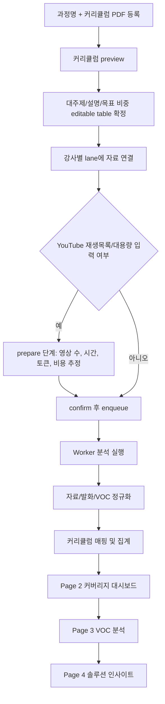
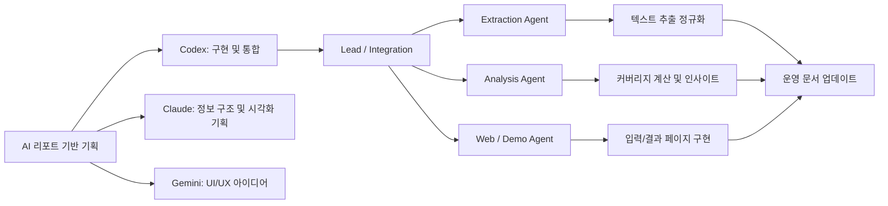

# Study Labs

> 강의 표준화를 위한 강사별 커리큘럼 비교 분석 솔루션

`Study Labs`는 동일한 과정을 여러 강사가 운영할 때 발생하는 수업 편차를 줄이기 위한 공모전용 MVP입니다.  
이 프로젝트는 강의자료, YouTube 강의 영상, 수강생 평가서(VOC)를 표준 커리큘럼 기준으로 정규화해 강사별 커버리지 차이와 개선 포인트를 비교해서 보여줍니다.

핵심 메시지는 단순합니다. 이 시스템은 `강사 품질 점수`를 만드는 서비스가 아니라, `표준 커리큘럼 대비 강사별 커버리지 편차를 설명 가능한 방식으로 보여주는 분석기`입니다.

## 1. 왜 필요한가

같은 과정이라도 강사마다 강조하는 단원, 사용하는 예시, 실제 발화에서 시간을 쓰는 영역이 달라질 수 있습니다. 그 결과 수강생은 반마다 다른 학습 경험을 겪고, 교육 운영자는 과정 표준화와 품질 관리에 어려움을 겪습니다.

저희는 이 문제를 단순 출결 관리나 자료 배포 중심의 LMS만으로는 해결하기 어렵다고 봤습니다. 실제 수업 운영은 강의계획서 같은 정형 데이터만으로 설명되지 않고, 문서 자료, 강의 발화, VOC 같은 비정형 데이터에 핵심 단서가 숨어 있기 때문입니다.

### 해결하려는 사용자 문제

| 사용자 | 현재 문제 | Study Labs가 주는 가치 |
| --- | --- | --- |
| 교육 운영자 | 동일 과정의 강사별 편차를 객관적으로 파악하기 어렵다 | 표준 커리큘럼 대비 편차, 강사 평균 대비 차이, VOC 기반 리스크를 한 번에 본다 |
| 교강사 | 자신의 수업 구성이 표준안이나 동료 강사와 얼마나 다른지 알기 어렵다 | 자료/발화/VOC를 근거로 자가 점검이 가능하다 |
| 수강생 | 같은 과정인데 반마다 배우는 깊이와 강조점이 다를 수 있다 | 운영자가 표준화와 개선 포인트를 빠르게 식별할 수 있다 |

## 2. 무엇을 해결하는가

Study Labs는 교육 현장의 비정형 데이터를 분석 가능한 형태로 바꿔 세 가지 축으로 보여줍니다.

1. `커리큘럼 커버리지 비교`
   - 표준 커리큘럼과 실제 강의자료/강의발화의 비중 차이를 시각화합니다.
2. `VOC 기반 불만 및 만족 요인 분석`
   - 수강생 평가서에서 반복 불만, 긍정 포인트, 개선 제안을 정리합니다.
3. `Gap 기반 운영 인사이트`
   - 표준 대비 과소/과대 커버된 주제와 강사 간 편차가 큰 주제를 우선순위로 제시합니다.

### 이 MVP가 산출하는 실제 결과

| 페이지 | 역할 | 실제 출력 |
| --- | --- | --- |
| `Page 1 (\`/\`)` | 과정 등록 및 분석 입력 | 과정 추가, 강사별 자료/YouTube/VOC 업로드, 분석 요청 |
| `Page 2 (\`/jobs/{job_id}\`)` | 커버리지 대시보드 | 도넛/바/레이더/워드클라우드, `combined/material/speech` 비교 |
| `Page 3 (\`/review\`)` | VOC 결과 페이지 | 문항 평균 점수, 감성 키워드, 반복 불만, 개선 포인트 |
| `Page 4 (\`/solution\`)` | 개선 인사이트 페이지 | 표준 대비 Gap, 강사별 표준 준수도, VOC 기반 인사이트 |

## 3. 심사위원용 데모 흐름

심사위원이 이 프로젝트를 볼 때 가장 직관적인 흐름은 아래와 같습니다.

1. `과정 추가`에서 과정명, 커리큘럼 PDF, 강사 roster를 등록합니다.
2. 커리큘럼 PDF preview 결과를 확인합니다.
   - `accepted`, `review_required`, `rejected` 여부와 관계없이 표는 항상 수정 가능합니다.
   - 자동 추출이 부정확해도 사용자가 직접 대주제와 비중을 정리해 저장할 수 있습니다.
3. 메인 composer에서 강사별 lane에 자료를 연결합니다.
   - 강의자료: `PDF`, `PPTX`, `TXT/MD`
   - YouTube: 단일 영상 URL 또는 재생목록 URL
   - VOC: `PDF`, `CSV`, `TXT`, `XLSX`, `XLS`
4. YouTube 입력이 크거나 재생목록이 포함되면 `prepare -> confirm -> enqueue` 단계로 분석 범위를 먼저 확인합니다.
5. 분석이 끝나면 `Page 2`에서 강사별 커버리지 편차를 확인합니다.
6. `Page 3`에서 VOC 분석 결과를 보고, `Page 4`에서 다음 기수 운영을 위한 개선 인사이트를 확인합니다.

### 서비스 처리 흐름



## 4. 지원 입력과 출력

### 입력 포맷

| 구분 | 지원 형식 | 처리 방식 |
| --- | --- | --- |
| 과정 등록 | `커리큘럼 PDF` | preview 후 대주제/비중 초안 생성, 사용자 수정 가능 |
| 강의자료 | `PDF`, `PPTX`, `TXT`, `MD` | 문서 텍스트 추출 후 chunking |
| 영상 | `YouTube URL`, `YouTube Playlist URL` | metadata 해석, transcript 수집, 필요 시 STT fallback |
| VOC | `PDF`, `CSV`, `TXT`, `XLSX`, `XLS` | 자유의견 추출, 설문형 workbook 점수 집계 |

### Page 1 입력 구조

Page 1은 강사별 lane 단위로 동작합니다. 각 lane은 실제로 아래 3개 bucket을 분리해 유지합니다.

- `files`: 강의자료
- `youtubeUrls`: 강의 영상 링크
- `vocFiles`: 강의평가서

이 분리는 단순 UI 상태가 아니라 실제 submit payload의 기준입니다. 즉, rail에 보이는 자료 구성이 서버로 보내지는 구성과 일치하도록 설계되어 있습니다.

## 5. 내부 로직

이 프로젝트의 핵심은 “비정형 교육 데이터를 어떻게 표준 커리큘럼에 보수적으로 매핑할 것인가”에 있습니다.

### 5.1 커리큘럼 PDF preview

커리큘럼 preview는 아래 순서로 동작합니다.

1. PDF에서 페이지별 텍스트를 추출합니다.
2. `OPENAI_CURRICULUM_MODEL`이 가능하면 OpenAI 기반 preview를 먼저 시도합니다.
3. 실패하거나 비활성화된 경우 로컬 규칙 기반 preview로 fallback 합니다.
4. 시간표형 PDF, `강의 구성 로드맵`, `총 N강` 같은 구조적 힌트가 있으면 비중을 자동 산출합니다.
5. 결과는 `accepted | review_required | rejected` 중 하나로 표시되지만, 저장 가능 여부는 최종 editable table의 유효성으로 판단합니다.

즉, 자동 분류는 사용자 보조 장치일 뿐이고, 사용자가 수정해서 확정한 표준 커리큘럼이 최종 계약입니다.

### 5.2 추출과 정규화

입력 자산은 공통 텍스트 세그먼트로 정규화됩니다.

- PDF/PPTX/TXT/MD는 문서 텍스트를 추출합니다.
- YouTube는 transcript를 우선 사용합니다.
- 공개 자막이 없으면 설정에 따라 selective STT fallback이 동작할 수 있습니다.
- VOC는 자유의견 텍스트와 설문형 점수 문항을 분리 추출합니다.

이 단계의 목표는 “모든 입력을 하나의 분석 엔진이 다룰 수 있는 공통 포맷으로 바꾸는 것”입니다.

### 5.3 Chunking 전략

입력마다 다른 chunking 규칙을 사용합니다.

| 소스 | chunking 원칙 | 이유 |
| --- | --- | --- |
| 강의자료 | 페이지/슬라이드 경계를 보존 | 여러 주차 내용을 한 chunk에 섞지 않기 위해 |
| 강의발화 | 더 작은 subchunk, overlap 0 | 긴 라이브 영상에서 특정 단원 쏠림을 줄이기 위해 |
| 기타 텍스트 | 일반 chunking | 공통 파이프라인 유지 |

추가로 worksheet noise, 비언어 자막(`[음악]` 등), 저신호 텍스트는 분석에 불리한 방향으로 작동하지 않도록 걸러냅니다.

### 5.4 커리큘럼 매핑

커리큘럼 section assignment는 두 경로 중 하나로 동작합니다.

| 모드 | 사용 조건 | 설명 |
| --- | --- | --- |
| `openai-embeddings` | OpenAI 사용 가능, 규모가 적절한 경우 | section과 chunk를 임베딩 유사도로 비교 |
| `lexical` / `lexical-fallback` | OpenAI 미사용 또는 실패 시 | `kiwipiepy` 기반 tokenization + lexical similarity 사용 |

매핑은 공격적으로 하지 않고 보수적으로 합니다.

- material은 section `title + description` 기반 anchor를 우선 사용합니다.
- speech는 transcript anchor와 chapter title rescue를 함께 보조 신호로 씁니다.
- 점수 차이가 애매하거나 근거가 약하면 강제로 배정하지 않고 `Other / Unmapped`로 남깁니다.

이 원칙은 보기 좋은 차트를 만드는 것보다, 잘못된 확신을 줄이는 쪽에 더 가깝습니다.

### 5.5 커버리지 계산

Page 2에서 보여주는 비중은 raw total token이 아니라 `mapped-only share` 기준입니다.

즉,

- 어떤 텍스트가 특정 대단원에 충분히 근거 있게 매핑되었는가
- 그 mapped token 안에서 각 대단원이 얼마만큼 비중을 차지하는가

를 보여줍니다.

그래서 source는 존재하지만 mapped coverage가 0인 mode는 차트를 억지로 그리지 않고 empty state로 처리합니다. 또한 `mapped_tokens / total_tokens`가 낮은 경우에는 coverage note를 함께 노출해, 사용자가 이 숫자를 전체 발화 100%로 오해하지 않도록 했습니다.

### 5.6 키워드와 워드클라우드

워드클라우드는 coverage 분모와 별개로 raw 텍스트의 특징을 보여주기 위해 유지합니다.

- 별도 tokenizer 경로를 사용합니다.
- current-run 기준 TF-IDF를 적용합니다.
- 반복 등장 단어에는 가중치를 줍니다.
- 저신호 구어체와 숫자형 noise는 더 공격적으로 제거합니다.

이렇게 해서 “실제로 어떤 표현이 강사의 수업을 지배했는가”를 커버리지 지표와 분리해 볼 수 있게 했습니다.

### 5.7 VOC 분석

VOC 분석은 두 층으로 구성됩니다.

1. `정량`
   - survey workbook의 `BQ` 계열 문항 평균 점수 집계
2. `정성`
   - 자유의견에서 긍정/부정 키워드, 반복 불만 패턴, 다음 기수 개선 제안 추출

LLM 호출이 가능하면 더 구조화된 결과를 만들고, 실패하면 규칙 기반 fallback으로 결과를 보존합니다. 즉, VOC 섹션도 “AI가 안 되면 아무것도 안 나오는” 구조가 아니라 “가능하면 더 좋게, 아니면 최소한 설명 가능한 fallback” 구조를 취합니다.

### 5.8 솔루션 인사이트

`/solution` 페이지는 아래를 함께 봅니다.

- 표준 커리큘럼 목표 비중
- 강사 평균 actual share
- 강사별 실제 비중
- VOC 요약

LLM을 사용할 수 있으면 Gap과 우선 점검 주제를 바탕으로 insight card를 생성하고, 실패하면 deterministic fallback card를 보여줍니다.  
최근 동향 분석은 실시간 웹 검색 제품이 아니라, 현재는 LLM 보조 인사이트 수준으로 유지하고 있습니다.

## 6. AI 및 Agent 활용 전략

이 프로젝트에서의 AI 활용은 두 층으로 나뉩니다.

1. `제품 내부에서 사용자 데이터를 분석하는 AI`
2. `개발 과정에서 구현 품질을 높이는 AI/Agent 협업`

### 6.1 제품 내부 AI 활용

| 영역 | 실제 사용 방식 | 목적 |
| --- | --- | --- |
| 커리큘럼 preview | `OPENAI_CURRICULUM_MODEL` + 로컬 fallback | 커리큘럼 구조와 비중 초안 생성 |
| section assignment | OpenAI embeddings 또는 lexical fallback | 자료/발화를 대단원에 매핑 |
| VOC 분석 | `OPENAI_INSIGHT_MODEL` + 규칙 기반 fallback | 자유의견 요약과 불만 패턴 추출 |
| 솔루션 인사이트 | `OPENAI_INSIGHT_MODEL` + deterministic fallback | 운영자용 개선 포인트 생성 |

중요한 원칙은 `AI를 모든 단계에 무조건 적용하지 않는다`는 점입니다. 데이터 규모가 크거나 비용/지연이 불필요하게 커질 경우 lexical 경로로 전환하고, 재생목록이 큰 경우 먼저 추정치를 보여준 뒤 사용자가 확인하도록 설계했습니다.

### 6.2 개발 과정의 AI/Agent 협업

공모전 제출용 AI 리포트에서 정리한 전략은 다음과 같습니다.

- `Codex`: 구현, 통합, 디버깅, 테스트 중심
- `Claude`: 정보 구조, 대시보드 지표 구성, 문서화 보조
- `Gemini`: UI/UX 시안과 시각적 방향성 보조

다만 실제 저장소에서는 단순 아이디어 수준이 아니라, 운영 문서와 file ownership까지 갖춘 에이전트 협업 구조로 구체화했습니다.

#### 저장소의 에이전트 운영 계약

| 역할 | 주요 책임 | 대표 소유 범위 |
| --- | --- | --- |
| `Lead / Integration` | 제품 정의, 공통 계약, 통합, 운영 문서 | `README.md`, `.agent/*`, `config/jobs/storage/worker` |
| `Extraction Agent` | 파일/URL 텍스트 추출 정규화 | `final_edu/extractors.py` |
| `Analysis Agent` | chunking, 매핑, 커버리지 집계 | `final_edu/analysis.py`, `final_edu/utils.py` |
| `Web / Demo Agent` | FastAPI route, 템플릿, 스타일, 데모 흐름 | `final_edu/app.py`, `templates/*`, `static/*` |

작업 시작 전에는 `AGENTS.md -> .agent/AGENTS.md -> .agent/STATUS.md -> .agent/DEBUG.md -> git status` 순으로 preflight를 수행합니다.  
작업 중 해결한 오류는 `DEBUG.md`에, 현재 상태는 `STATUS.md`에 남겨 다음 에이전트가 전체 히스토리를 다시 읽지 않고도 이어서 작업할 수 있게 했습니다.

### Multi-Agent Collaboration 구조



### 토큰 낭비를 줄이고 재현성을 높인 전략

- `조건부 라우팅`
  - 작은 작업은 OpenAI, 큰 작업은 lexical로 자동 전환
- `Prepare-Confirm-Enqueue`
  - 대용량 YouTube 입력의 비용/처리시간을 먼저 추정
- `선택적 컨텍스트 주입`
  - 모든 히스토리를 재주입하지 않고 `AGENTS/STATUS/DEBUG`를 필요한 만큼만 참조
- `병렬 lane 분리`
  - write scope와 ownership을 고정해 중복 수정을 방지
- `fallback 우선 설계`
  - OpenAI 실패 시에도 가능한 결과를 남김

## 7. 시스템 아키텍처

### 애플리케이션 구조

| 레이어 | 현재 스택 |
| --- | --- |
| Web | `FastAPI + Jinja + Vanilla JS + CSS` |
| Worker | `RQ worker` |
| Queue | `Redis / Render Key Value` 또는 `inline` fallback |
| Storage | local object storage 또는 `Cloudflare R2` |
| 문서형 운영 계약 | `.agent/AGENTS.md`, `.agent/STATUS.md`, `.agent/DEBUG.md` |

### 실행 모드

| 구분 | 동작 |
| --- | --- |
| `queue_mode=inline` | Redis 없이 웹 프로세스 내에서 바로 분석 가능 |
| `queue_mode=rq` | Web과 Worker를 분리해 백그라운드 분석 |
| `storage_mode=local` | 로컬 runtime 디렉토리 사용 |
| `storage_mode=r2` | object storage에 결과와 과정 레코드 저장 |

### 배포 형태

현재 `render.yaml`은 아래 구조를 전제로 합니다.

- Render Web
- Render Worker
- Render Key Value
- 외부 Object Storage(R2)

이 구조는 로컬 개발과 배포 환경 모두에서 동일한 분석 계약을 유지하되, 운영 환경에서는 Web/Worker 분리와 object storage persistence를 확보하기 위한 선택입니다.

## 8. 신뢰성과 검증

이 프로젝트는 “보여주기용 차트”보다 “잘못된 결론을 줄이는 것”을 더 중요하게 둡니다. 그래서 테스트도 화면 렌더링 자체보다 계약과 fallback 동작을 많이 검증합니다.

### 어떤 것을 검증하는가

| 검증 영역 | 대표 보장 내용 | 관련 테스트 |
| --- | --- | --- |
| 커리큘럼 preview | 암호화/손상 PDF 처리, chapter roadmap 비중 산출, 수동 섹션 저장 허용 | `tests/test_course_preview.py` |
| YouTube 입력 | watch URL과 playlist 구분, probe 정책, metadata 해석 | `tests/test_youtube_inputs.py` |
| YouTube cache/throttle | metadata/transcript cache, request spacing, STT fallback 경계 | `tests/test_youtube_cache.py` |
| Page 1 입력 계약 | draft restore, `files/youtube/voc` 분리, legacy reset, submit payload 일치 | `tests/test_page1_restore.py` |
| Page 2 결과 계약 | mode availability, mapped-only share, material/speech assignment, word cloud | `tests/test_page2_dashboard.py` |
| VOC 분석 | CSV/XLSX/XLS 자유의견 추출, survey workbook 점수 집계, solution/review payload | `tests/test_voc_analysis.py` |
| persistence | object-storage backed course repository, redeploy 이후 과정 유지 | `tests/test_course_repository.py` |
| runtime | Render web/worker 역할 분리, Kiwi readiness, progress phase | `tests/test_render_runtime.py` |

### 신뢰를 높이는 설계 원칙

- 잘못된 강제 분류보다 `Unmapped`를 허용합니다.
- source가 없거나 mapped coverage가 없으면 empty state를 보여줍니다.
- OpenAI 실패 시 결과 전체가 무너지는 구조를 피합니다.
- 표준 커리큘럼 비중은 사용자가 최종 수정한 값이 canonical source가 됩니다.
- 결과 페이지는 실제 업로드/분석 결과만 사용하고, fake instructor/fake keyword를 섞지 않습니다.

## 9. 이 프로젝트의 차별점

이 MVP의 차별점은 단순히 “교육 데이터를 AI로 분석했다”가 아닙니다.

1. `강의자료`와 `실제 강의 발화`를 분리 분석합니다.
   - 계획된 내용과 실제 수업에서 강조된 내용의 차이를 함께 볼 수 있습니다.
2. `VOC`를 별도 페이지와 인사이트 흐름으로 연결합니다.
   - 커버리지 편차와 수강생 불만의 상관관계를 함께 볼 수 있습니다.
3. `조건부 AI 사용 + fallback` 구조를 취합니다.
   - 고성능 모델이 없어도 시스템이 동작하고, 대용량 입력에서는 비용을 통제합니다.
4. `Agentic Workflow`를 개발 프로세스 자체에 내재화했습니다.
   - 운영 문서, ownership, parallel lane, review loop를 통해 재현성을 높였습니다.

## 10. 한계와 정직한 범위

현재 MVP는 아래 범위를 의도적으로 넘어서지 않습니다.

- 스캔 PDF용 OCR은 아직 구현하지 않았습니다.
- YouTube 분석은 자막 또는 STT 가능성에 영향을 받습니다.
- 구조가 모호한 VOC workbook은 자동 보정 대신 거부할 수 있습니다.
- 외부 동향 인사이트는 실시간 웹 검색 기반 제품이 아닙니다.
- 단일 숫자로 강사 품질을 판정하지 않습니다.

이 한계는 기능 부족의 고백이라기보다, 공모전 MVP 단계에서 설명 가능성과 신뢰성을 우선하기 위한 선택입니다.

## 11. 실행 부록

### 빠른 실행

```bash
uv sync
uv run python -m final_edu --reload
```

Worker가 필요한 배포/분리 실행 환경에서는 아래 명령을 사용합니다.

```bash
uv run python -m final_edu.worker
```

`REDIS_URL`이 없으면 로컬에서는 `inline` fallback으로 동작하므로, 간단한 검증에는 별도 worker가 필수는 아닙니다.

### 핵심 환경 변수

| 변수 | 역할 |
| --- | --- |
| `OPENAI_API_KEY` | OpenAI 기반 preview/assignment/insight 활성화 |
| `OPENAI_EMBEDDING_MODEL` | section assignment 임베딩 모델 |
| `OPENAI_INSIGHT_MODEL` | VOC/solution 인사이트 모델 |
| `OPENAI_CURRICULUM_MODEL` | 커리큘럼 preview 모델 |
| `FINAL_EDU_RUNTIME_DIR` | 로컬 runtime 디렉토리 |
| `FINAL_EDU_MAX_UPLOAD_MB` | 업로드 용량 제한 |
| `FINAL_EDU_KIWI_MODEL_PATH` | Kiwi 모델 경로 override |
| `REDIS_URL` | queue backend 활성화 |
| `R2_ENDPOINT_URL`, `R2_ACCESS_KEY_ID`, `R2_SECRET_ACCESS_KEY`, `R2_BUCKET` | object storage 활성화 |

### 주요 라우트

| Route | 설명 |
| --- | --- |
| `GET /` | 과정 등록 및 분석 입력 화면 |
| `POST /courses/preview` | 커리큘럼 PDF preview |
| `POST /courses` | 과정 저장 |
| `POST /analyze/prepare` | 대용량/playlist 준비 단계 |
| `POST /analyze/prepare/{request_id}/confirm` | 분석 확정 및 enqueue |
| `POST /analyze` | 바로 분석 실행 |
| `GET /jobs/{job_id}` | 커버리지 결과 페이지 |
| `GET /review` | VOC 결과 페이지 |
| `GET /solution` | 솔루션 인사이트 페이지 |
| `GET /jobs/{job_id}/status` | 상태 polling |
| `GET /health` | 헬스 체크 |

---

## 결론

Study Labs는 교육 운영 현장에서 가장 설명하기 어려운 문제인 `같은 과정을 가르치지만 실제로는 다르게 전달되는 수업`을 데이터로 보여주기 위한 프로젝트입니다.  
표준 커리큘럼, 실제 강의자료, 실제 발화, 수강생 VOC를 한 흐름으로 연결해 운영자와 강사가 더 빠르게 점검하고 개선할 수 있도록 설계했습니다.

공모전 관점에서 이 프로젝트가 보여주고자 하는 것은 두 가지입니다.

- 생성 AI를 무작정 많이 쓰는 것이 아니라, 필요한 구간에만 선택적으로 배치해 비용과 신뢰성을 함께 관리할 수 있다는 점
- 교육 현장의 비정형 데이터를 설명 가능한 운영 도구로 바꿀 수 있다는 점
